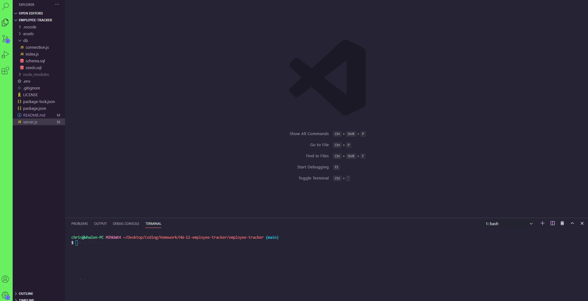

# Employee Tracker

## Contributers
* Chris Whalen, Github: **[CobaltFrostfish](https://github.com/CobaltFrostfish)**

## Links
* **[Repository](https://github.com/CobaltFrostfish/employee-tracker)**
* **[Video example](https://github.com/CobaltFrostfish/employee-tracker/blob/main/assets/employee-track-vid.gif)**
# 

## The project
Is your business rapidly growing? Are you having to hire employees like mad in order to keep up with your business demands? Are you in need of a system to help track your employees? Well say hello to the Employee Tracker! With this application you can easily add employee's, their positions and salary, and their departments. Had an employee change positions? No need to worry, theres a function to update your emplolyees status built right into the app. So give it a try and build your team!

## Technologies applied
* JavaScript
* NodeJS
* MySQL
* MyBrain

## The final production:

